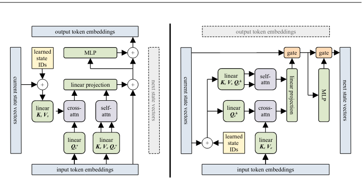
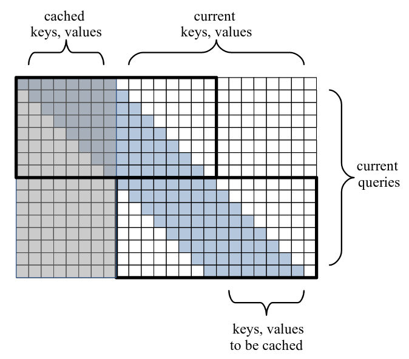

# Block Recurrent Transformer

</img>

A PyTorch implementation of [Hutchins & Schlag et al.](https://arxiv.org/abs/2203.07852v1). Owes very much to Phil Wang's [x-transformers](https://github.com/lucidrains/x-transformers). Very much in-progress.

Dockerfile, requirements.txt, _and_ environment.yaml because I love chaos.

</img>

